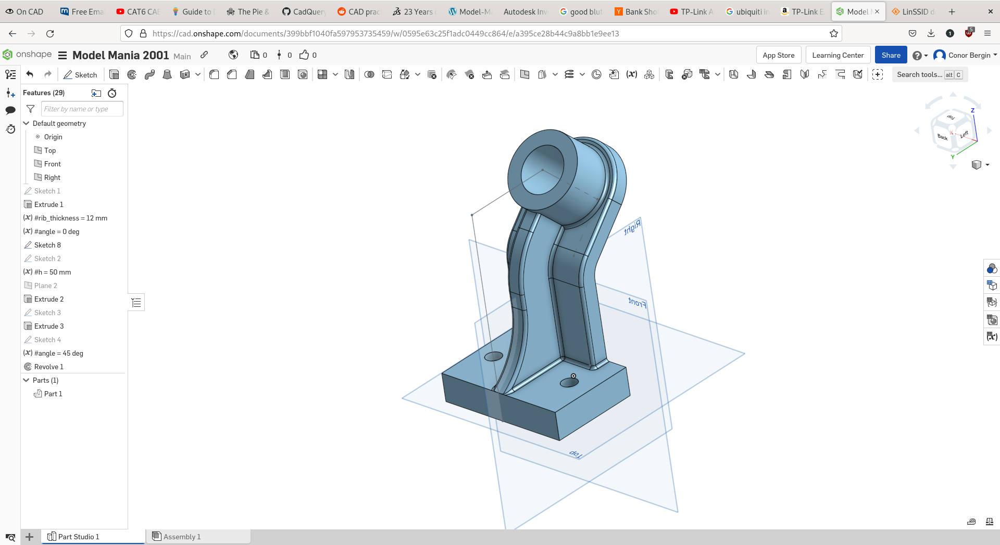
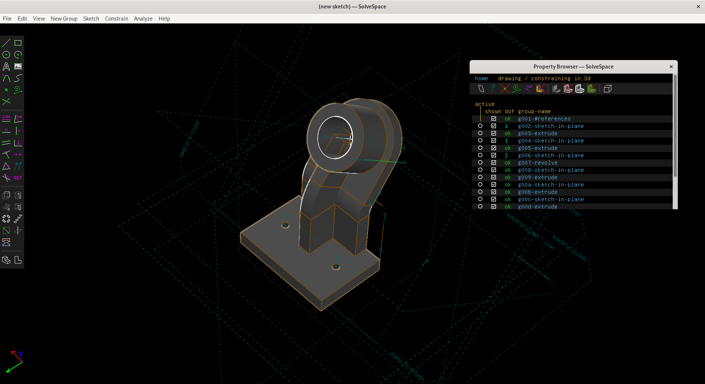

With cheap 3D printers and PCB manufacturing services you could conceivably design something and have a physical prototype on your desk in the same week.
It is quite common to see hardware projects on github that contain firmware source code, STLs for 3D printed parts, and Gerber files for PCBs.
To assemble them you need to be able to solder, use a hot-glue gun, and operate a screwdriver.

This new sort of manufacturing is just as accessible to a hobbyist as it is to a corporation.
I have found ergonomic computer keyboards, RC car parts, fountain pen feeds, and a multitude of parts and mods for 3D printers themselves.

If you do not feel like writing the g-code yourself, you will need a 3D CAD program to generate the geometry, and a slicer (CURA, Slic3r) to convert it into layers for the 3D printer.

## Defining Terms
3D CAD packages are defined by their underlying data structures.

Solid geometry can be built using Constructive Solid Geometry (CSG), which is a tree of boolean operations, or Boundary Representation (B-Rep), which relates individual surfaces to one another.
Most CAD software will use B-Rep, but will stil be able to do CSG operations (Union, Intersection, etc).
The only example of a CAD with a CSG kernel that I am aware of is OpenSCAD.

## Comparison

I decided to do a comparison of the various CAD programs available to me on Linux.
I made the same part in each, from the [2001 Model Mania](https://blogs.solidworks.com/tech/2022/02/23-years-of-model-mania.html).

When I initially wrote this post, I only had experience in Solidworks, obviously not available on Linux.
As a result, I didn't approach the problem very methodically, and my findings were not very representative of the strengths and weaknesses of the different programs.
After recieving some fair criticism, I though it would be best to redo it.
On the second time round, I made sure to time myself accurately and build the model in the same way, making sure the dimensions were all correctly parametrized.

The model is fairly straight forward, but for fact that two important dimensions are not given, but have to be calculated.
There is a dimension for the angle of the bend, but its location on the extrusion is not given.
Instead you are given the overall dimesnions of the part.
There is enough information there to solve the model, but you have to set up your sketches correctly.

In phase two of the challenge, you have to make the same model with a few altered dimensions.
If you make a properly parametrized model, phase 2 will take seconds, if you make a dogs dinner, you might find yourself dealing with various unintended consequences.

### OnShape

20:42 - with fillets.

Quite painless, OnShape has much in common with Solidworks, which is what I'm used to.
I had a bit of a hiccup with the fillets at the end, they need to be applied in a certain order or the model will break
 

### FreeCAD

36:58 - without fillets.

FreeCAD has pretty much all the features OnShape has, more even, but it is much less polished.
I found myself making many more mouse clicks, I would have been much faster if I learned a few more keyboard shortcuts, and the UI is difficult to navigate.

I wasted some time trying to get the link edges feature to work in sketcher, I ended up redrawing some of the sketches.
FreeCAD, unlike Solidowrks and OnShape, will only allow you to extrude a sketch that is also a closed loop, so any extending lines will cause problems.

FreeCAD can actually do fillets, but this model has some complex intersections that it just can't handle.

### Solvespace

25:16 - no fillets

This was the last model I did, so I had the advatage of knowing the dimesions off the top of my head, but it is also by far the smallest and least featured of the three.
Solvespace has a very easy UI once you understand it, there is practically nothing there.

I wasted some time because I started modelling the part in half, expecting to be able to mirror it when I got to the end. There is no such feature in Solvespace. I was fine after I converted all my extrudes to symmetric and redrew a couple of sketches.
There is no hole tool so I had to manually make my counterbore bolt holes with two sketches.
There is no scroll to zoom, which is a bit odd.
You can't just select a face to start a new sketch, instead you select two lines and a point.

That being said, solvespace is so much less clunky than FreeCAD, arguabley OnShape too.

### OpenSCAD

1:02:16

This is a CSG that uses a DSL to define its models.
The language itself is quite nice to use, but the kernel is severly limited.
The idiomatic way to make models with OpenSCAD is boolean operations with primitve shapes.
You can't just attach shapes to other shapes, you have to work out their offsets and apply transformations manually.
Because the models are declarative, and can be split into modules and functions, they end up being quite robust, and easy to troubleshoot.

Filleting is completely out of the question, you can make a rectangle with rounded edges and extrude it, and you can do some clever things with the intersection operation, but you can't finish a model and just add fillets to it.

### CADQuery

CADQuery is another script based CAD, but this time leveraging OpenCascade, the same kernel FreeCAD uses, and using Python rather than its own domain specific language.
It is less mature than OpenSCAD, its primary competitor, and is a bit of a pain to install.
If you want the latest version with the sketch subsytem, you need to use this github action.
The sketch subsystem crashed on me, so it might be best to wait for an official release before you use it.
The releases are distributed as a zip archive or a miniforge package.
I don't want anything to do with conda so I used the zip archive.

It does have some advantages over OpenSCAD, it uses a B-Rep kernel, and it uses python. So while it is less mature, it should be much less limited.

