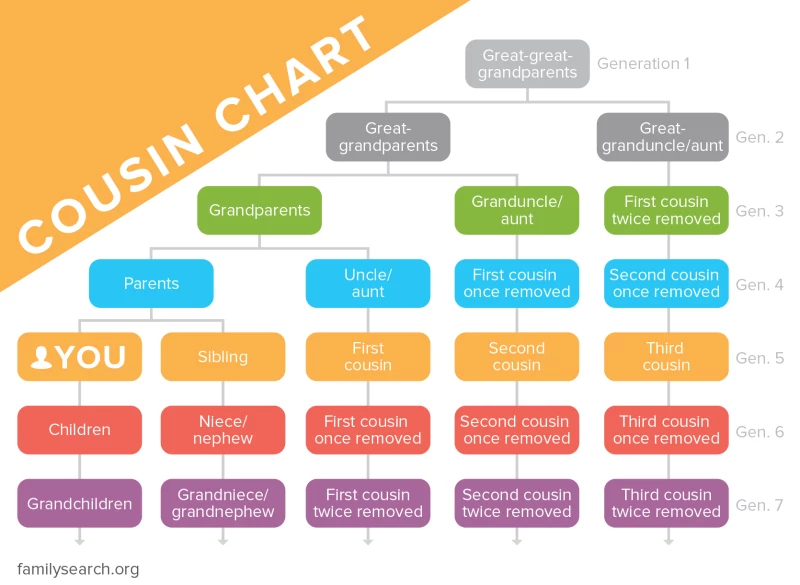

I just saw a cockroach in my kitchen.
Initially, I hoped I was looking at a bit of cockroach shaped debris -- or at least some other sort of insect.
Disgusted and a bit afraid, I had to accept I was looking at the real thing.

It then occured to me that because we shared a common ancestor we were both in each others extended families.
This is obvious, of course, but I was amused by the fact that we are literally related.

The cockroach is some sort of _nth_ cousin _m_ times removed to me.

I tried to squash it with a broom, but I was too slow, and the cockroach scuttled under a cupboard. Feeling ambivalent about my failure, I wondered what _n_ and _m_ are.

## Ancestry

From this chart it should be obvious that the cockroach will be some sort of xth cousin y times removed.

Within human populations things a more complicated. If you live on an island with a small population and few visitors, you may have no choice but marry your second cousin. That second cousin could also be your fourth cousin on your mothers side. The islands family trees are all woven together. Even in large populations this is still the case, but with many more degrees of separation. 

## Phylogentic tree

Speciation occurs when a species splits into two populations that stop interbreeding with each other. For us and cockroaches this happened a long time ago.

This does simplify my original question, in a way.
As there is no interbreeding between us an cockroaches, our phylogentic strands are clearly separated from each other.
The question now becomes, how many generations precede me and how many precede the cockroach since we went our separate ways in the tree of life.

We will have to take a few liberties.

Cockroaches are an ancient insect, they are sucessful generalists and have remained relatively unchanged sinc there inception, we can use modern data and extrapolate backwards.

Humans have a more complex prehistory, throughout the mezozoic we were shrew like animals, living in the shaodw of the dinosaurs. After the K-Pg extiction we were early primates, we diverged from the lemurs, then the monkeys, gibbons, oragutangs, gorillas, chimpanzees and finally the other hominids.

Cockroaches, being insects, split from humans at 560 mya.
We are both part of Nephrozoa, and our last common ancestor (or great-great-...-great-great grandparents) was probably some sort of worm.

After that we split from star fish at 560 mya, became chordates at 540 mya, then vertebrates at 525 mya, develped a jaw at 460 mya, bones at 430 mya, tetrapods at 340 mya, split from reptiles at 320 mya, developed a placenta at 90 mya ...

One intersting thing you see exploring mammal taxonomy is the prevalnce of things that look like shrews but aren't. Elephants are closely related to the elephant shrew. Tree shrews are more colosely related to primates that they are to shrews. Shrews themselves seem like tey should be a sort of reodent, but they arent, more closely related to moles and hedgehogs.

Invertebrates are more difficult to make assured statements about because they are less represented on the fossil record.

## Model

What data do we have that will help us work out the generation time of long extint animals?
I had a look around for an apropiate database, and settled on AnAge. It can be downloaded as a TSV, and seems to be the most comprehensive, using data from smaller, previous works and evauating the quality of the data.
It's pretty bereft of non-vertebrate entries, So I will have to look elsewhere for my cockroach data.

There are entries for female and male maturity, longevity, litter/clutch size and frequency, but no figure for generation time, so we will have to derive that ourselves.

According to the [wikipedia page](https://en.wikipedia.org/wiki/Generation_time), there are several interpretations of generation time, the one I mean to use is the average distance between parents and children. I should be able to take that number, and multiply it by a length of time, to get an estimate of how many generations have passed in some population over some period.

### Cockroach

### Human

## References

<small>

[1] Generation Time: A Reliable Metric to Measure Life‐History Variation among Mammalian Populations https://doi.org/10.1086/430330

This one contains a chart comparing different speicies 

[2] Generation length for mammals https://doi.org/10.3897/natureconservation.5.5734

Low quality data with less accurate model of generation time

[3] Female and male life tables for seven wild primate species https://doi.org/10.1038/sdata.2016.6 dataset:https://doi.org/10.5061/dryad.v28t5

High quality data with accurate model of generation time

</small>

