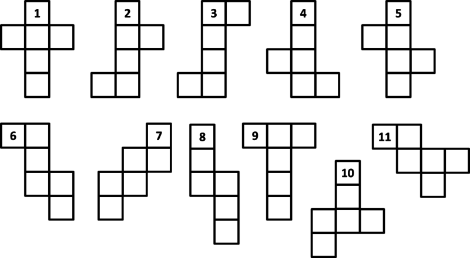

_8 Mar 2022_

This is the third year I have attempted AoC, and the first time I have finished it. Last year I used Julia, which I think is actually pretty close to perfect for this sort of thing, it has an REPL, linear algebra in the standard library and a clever JIT compiler that can produce code about as performant traditional compiled languages, much more convieniently. This year I wanted to write readable, performant, and robust code, and Rust seems to me the best language for that job. Did I succeed? No. Some of my solutions are nice, some are really not. I didn't do much clean up work, once I reached the mid forties my enthusiam started to wane.

Rust is great, as long as you don't write too much of it. I didn't have many problems with the borrow checker becuase I didn't allocate much. The inconvinience of moving data structurea around forced me to think about what I was actually trying to do with my code.

I used ```itertools``` a lot, the `iproduct!` macro in particular to avoid writing nested for loops.

### Day 22 part 2

This was perhaps the hardest problem of the year. Given a map, which was also the net of a cube, follow a route, and at every edge, wrap to the matching edge if the net were folded. One solution which was common on reddit was to hardcode the transitions of your net, but there was mutiple possible nets, my test input and puzzle input were different. I couldn't find much information about cube nets, and what I did find was in the format of worksheets for young children being introduced to maths. Which is odd, because it is an interesting problem.

<figure>

</figure>

There are eleven unique cube nets, ten are 3x4 and one is 2x5. I would be possible to check if your input was one of these valid nets and then hardcode the transitions for each one. This would be robust and very verbose.

After a few days of thinking, I realised that if you assume the cube net is valid, you don't need to know anything about the type of net it has. You can simply follow a path around the perimeter, clockwise or anti-clockwise, and match edges until you find the match for your starting edge:

1. Follow the edge of your starting point clockwise until you reach a boundary, record this length as your offset  
2. Check if the next edge is straight ('S'), turns inwards ('I') or outwards ('O') relative to the current edge  
3. If the edge is 'S' or 'I', push it to the stack. If it is 'O' and the previous edge is your starting edge, follow the edge by your offset and this is your finish point, otherwise push 'O' to the stack.  
4. If the previous edge was 'O', pop 3 edges from the stack. If the pattern is 'IOI' push 'S', if it was 'SOI' or 'IOS' push 'O' ('SOS' is not possible on a valid net)
5. go to 2.


### Day 25

The final challenge was to find the sum of a list of numbers, but the numbers were in 'snafu'. In 'snafu' there are five digits, '0','1' and '2' represent themselves, and '-' and '=' represent -1 and -2 respectively. The negative digits don't seem to change much, an n-digit snafu number has 5^n possible values, the same number as a n-digit base-5 number. I avoided the verbose and tedious task of writing function that convert snafu to and from base-10 by implementing native snafu addition using modular arithmetic.


``` rust
fn snafu_add(a: &str, b: &str) -> String {
    let d = ['=', '-','0', '1', '2'];
    let r = a.chars()
        .rev()
        .zip_longest(b.chars().rev())
        .map(|z| match z {
            EitherOrBoth::Both(l,r) => (l,r),
            EitherOrBoth::Left(l)   => (l,'0'),
            EitherOrBoth::Right(r)  => ('0',r)
        })
        .fold(String::from('0'), |mut acc, e| {
            let c = acc.pop().unwrap();
            let i = d.iter().position(|x| *x == e.0).unwrap();
            let j = d.iter().position(|x| *x == e.1).unwrap();
            let k = d.iter().position(|x| *x == c).unwrap();
            acc.push(d[(i+j+k+1)%5]);
            acc.push(d[(i+j+k+1)/5+1]);
            acc
        });
    r.trim_end_matches('0').chars().rev().collect()
}
```


