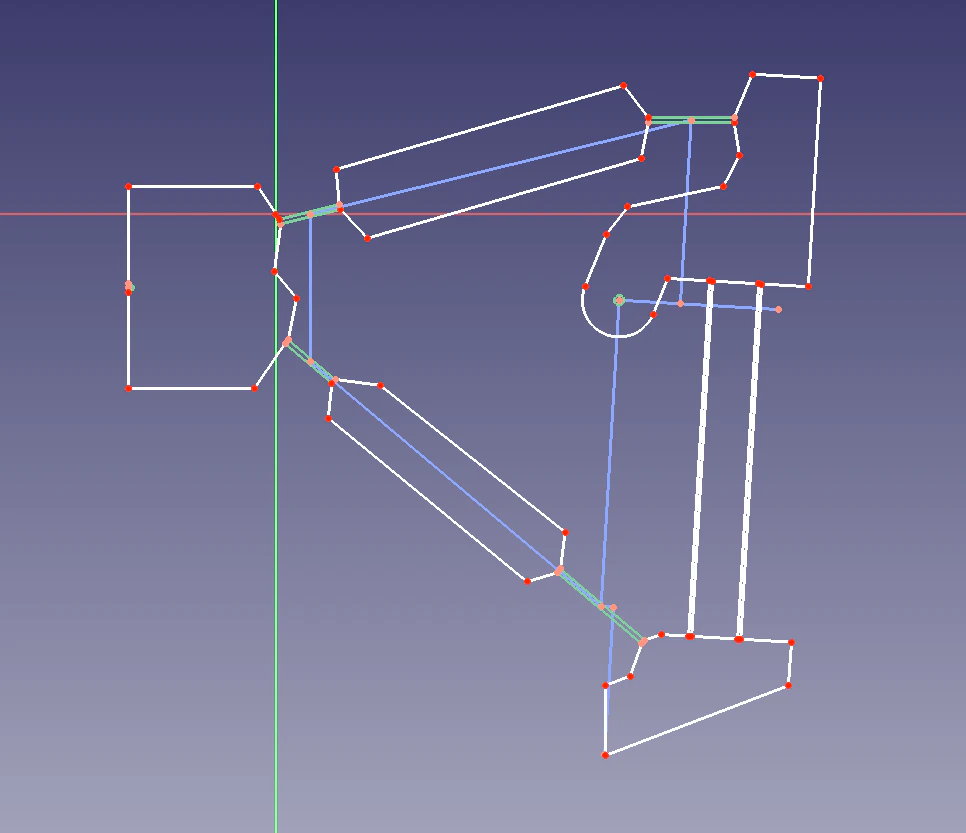

_Adapted from a University Project_

The [Strandbeests](https://www.strandbeest.com/) are a family of kinetic sculptures developed by Theo Jansen.
At their centre is a linkage which is responsible for their organic gait.
The linkage is driven by a crank, and its end effector is a foot.
It can be driven both fowards and backwards and at different speeds, making it analagous to a wheel.
If several of them are arranged in tandem, and the cycles are syncopated using a crankshaft so that the feet do not leave the ground all at once, you have a sort of walking trolley that can either be powered at the crank, pulled along, or made to descend an incline under its own weight. 

I thought it would be possible to make the linkages out of a single piece of plastic, making use of flexures instead of joints.
This comes with several advantages:
- I could easily 3D print complete sections of a Strandbeest
- Flexures do not need to be assembled, they do not need to be lubricated, nor do they wear out
- Flexures are less complex to model in CAD (though more complex to design)

## The difficulty of simulating large deflections

Unfortuantely, flexures are significantly more mathematically complex than joints.
I used Larry Howell's _Compliant Mechanisms_ almost exclusively, it is comprehensive and very readable.

I won't bore you with the theory, if you are interested I've detailed my adventures in simulating compliant mechanisms with multiple flexures [here](theory) (spoiler: I didn't get very far).

Fortunately, you can make a pretty good approximation of a flexure with linear springs and links, called the Pseudo-Rigid-Body Model (PRBM). They are explained in Chapter 5 of _Compliant Mechanisms_.
The most obvious PRBM is to model a small flexure as a single torsional spring in the middle.

## Using FreeCAD to Design Linkages

I tried several different rigid body solvers, but found them clumsy to use.
You would have to define your model using code, or import it from some CAD package.
I wanted something I could work on in realtime.
I started using FreeCAD to sketch out ideas, using the contraint solver in the Sketcher workbench as a poor man's rigid body solver.
I found that FreeCAD worked fine for my use case (I wasn't worryed about kinematics or dynamics at this point, I was looking for a mapping between crank angles and end effector position).
FreeCAD has a python interface, so I wrote a script that would periodically change the angle of the input link.

<figure class="centre">
<video controls>
<source src="media/screencast.webm" type="video/webm">
<source src="media/screencast.mp4" type="video/mp4">
Video not supported
</video>
<figcaption>Fig. 2</figcaption>
</figure>

I could then change the lengths of links as I watched the linkage cycle, observing how the charactaristics of the path of the foot changed. 
Once I had something that more or less worked I wrote a second script that recorded the path of the foot as a set of coordinates, then changed the geometry of the foot, and repeated.
When it had finished running I had a set of a hundred different paths, and I just had to select the best one.
Now that I had my finished PRBM, I set about turning it into the compliant linkage it was supposed to be representing.
I replaced all the joints with flexures and filled the spaces between with rigid bodies.

<figure class="centre"><figcaption>Fig. 3</figure>

I attempted to run a FEM analyis using CalculiX in Freecad, applying different displacements to try and replicate the effect of the crank turning. The results aren't good, I suspect because the internal solver is linear. Notice how the pivot hole expands and contracts oddly.

<figure>
<canvas id="prbm" width=850 height=850></canvas>
<figcaption>PRBM</figcaption>
</figure>
<figure>
<canvas id="fem" width=1095 height=1095></canvas>
<figcaption>FEM</figcaption>
</figure>

## The Printed Linkage
I mirrored the linkage to make a part with two feet with one input and sent it off to a 3D printing service.
I did have to reassure them that I wanted the flexures to be that thin, and that I would take the of risk them getting damaged in the post.
Here is the final linkage in action:

<figure>
<canvas id="final" width=1250 height=644 ></canvas>
<figcaption>Final</figcaption>
</figure>

As you can see the parallel flexures buckle due to the torque on the foot from the link to the pivot.
This is a limitation of using a PRBM, if I had found a better way of modelling the mechanism I might have been able to mitigate it.
That being said it still works reasonably well.
I never made a full Strandbeest using my mechanism, at this point I was completely sick of the project.

